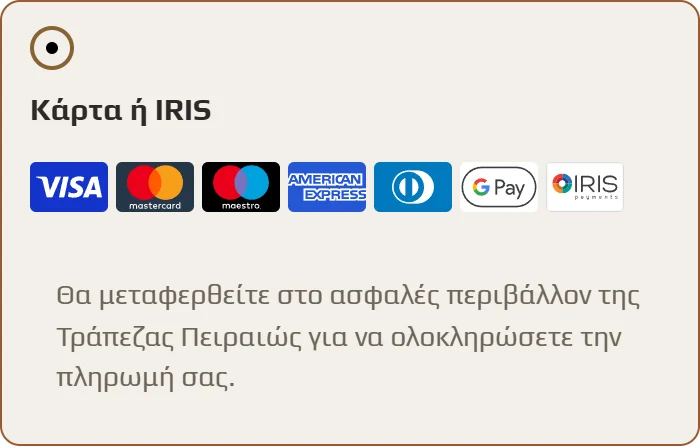

# Piraeus Bank WooCommerce Payment Gateway


An independently maintained fork of the [Piraeus Bank WooCommerce Payment Gateway](https://wordpress.org/plugins/woo-payment-gateway-for-piraeus-bank/) plugin by Papaki (Enartia S.A.), which was itself based on the plugin by emspace.gr. It accepts card, Google Pay and IRIS payments through the Piraeus Bank Paycenter hosted payment page.

The fork exists to run on current WordPress and WooCommerce releases in production and to ship fixes quickly. It is not affiliated with or endorsed by Papaki or Piraeus Bank.



## Features

- Redirect to the Piraeus Bank Paycenter hosted payment page (no card data touches the store)
- Visa, Mastercard, Maestro, American Express and Diners Club cards, Google Pay and IRIS instant payments
- Accepted payment brands shown as logos next to the gateway title, chosen in the settings
- HMAC-SHA256 verification of the bank's payment callback
- Free instalments and pre-authorised payments (see the notice about pre-authorisation below)
- Classic and Blocks checkout, and High-Performance Order Storage (HPOS)
- Wallet payments recorded on the order, with the detected method stored in the `_piraeusbank_payment_method` order meta (`card`, `iris`, `googlepay`)
- Optional HTTP proxy for outgoing requests to the bank

## Requirements

- WordPress with WooCommerce (tested with WordPress 7.1 and WooCommerce 11.1)
- PHP 7.4 or later, with the SOAP extension
- A Piraeus Bank e-commerce (Paycenter) merchant contract

## Installation

1. Upload the `woo-payment-gateway-for-piraeus-bank` folder to `/wp-content/plugins/` and activate it.
2. Send Piraeus Bank (epayments@piraeusbank.gr) the following URLs to receive test account details. With permalinks enabled:
   - Website URL: `https://www.yourdomain.gr/`
   - Referrer URL: `https://www.yourdomain.gr/checkout/`
   - Success page: `https://www.yourdomain.gr/wc-api/WC_Piraeusbank_Gateway?peiraeus=success`
   - Failure page: `https://www.yourdomain.gr/wc-api/WC_Piraeusbank_Gateway?peiraeus=fail`
   - Cancel page: `https://www.yourdomain.gr/wc-api/WC_Piraeusbank_Gateway?peiraeus=cancel`

   Without permalinks, use `https://www.yourdomain.gr/?wc-api=WC_Piraeusbank_Gateway&peiraeus=success` (and `fail`, `cancel`). Also give the bank the response method (GET or POST) and your server's outgoing IP address.
3. Enter the credentials the bank provides under WooCommerce → Settings → Payments → Piraeus Bank.

## Configuration

### Pre-authorised payments

Piraeus Bank is gradually withdrawing the pre-authorised payment service, starting with merchants whose MIDs were issued from 29 January 2019 onwards. Disable it unless the bank has confirmed it for your account.

### Cardholder name

For 3D Secure and SCA, the bank expects the cardholder's name before the redirect. If you untick "Enable Cardholder Name Field", the order's full name is sent instead, and the bank may refuse the transaction if it does not match.

### HTTP proxy

If your server has no static outgoing IP address, route requests to the bank through an HTTP proxy: fill in the proxy hostname and port, and optionally a username and password. An empty hostname disables the proxy.

### Billing state

Billing state is optional in EMV 3DS, so it is not a required checkout field. For countries where WooCommerce has no state list, you can add states by following [WooCommerce's instructions](https://woocommerce.com/document/addmodify-states/).

### Debug mode

Add these lines to `wp-config.php`, then enable debug mode in the plugin settings:

```php
define( 'WP_DEBUG', true );
define( 'WP_DEBUG_LOG', true );
define( 'WP_DEBUG_DISPLAY', false );
```

## Development and tests

There is no automated test suite. Before a release, check syntax on the lowest and highest supported PHP versions and run a payment on a staging store with a Piraeus Bank test account:

```bash
docker run --rm -v "$PWD:/app" -w /app php:7.4-cli sh -c 'find . -name "*.php" -print0 | xargs -0 -n1 php -l'
docker run --rm -v "$PWD:/app" -w /app php:8.3-cli sh -c 'find . -name "*.php" -print0 | xargs -0 -n1 php -l'
```

Issues and pull requests are welcome. Report security problems privately, as described in [SECURITY.md](SECURITY.md).

## Credits

- Original plugin: Papaki (Enartia S.A.), https://www.papaki.com
- Earlier original: emspace.gr
- Fork maintainer: Dimitrios Rarras, https://jimrarras.com

Piraeus Bank, IRIS, Google Pay and the card brand names and logos are trademarks of their respective owners.

## Support

If this plugin saves you time, you can buy me a coffee.

<a href="https://buymeacoffee.com/jimrarras"></a>

## License

GPL-3.0-or-later, following the upstream plugin. See [LICENSE](LICENSE).
